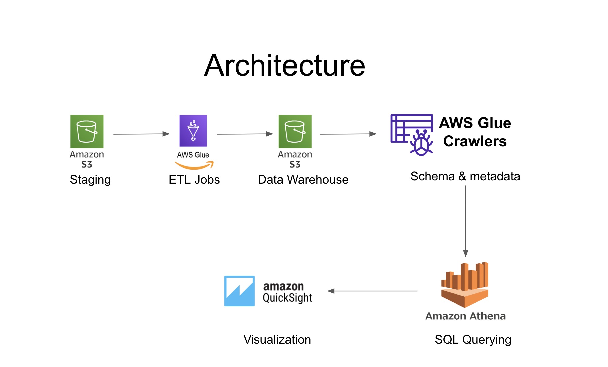

# Spotify Data Pipeline with AWS Glue and QuickSight

## Project Overview
This project demonstrates an ETL pipeline to process and visualize Spotify data using AWS services.

## Architecture


## Steps to Reproduce
1. **Upload Data to S3**
2. **Set Up AWS Glue Jobs**
3. **Run AWS Glue Crawler**
4. **Query Data with Amazon Athena**
5. **Visualize Data with QuickSight**


## Example Queries
```sql
SELECT artist_id, track_name FROM warehouse
WHERE genre = "LoFi"
GROUP BY artist_id
ORDER BY streams DESC;
