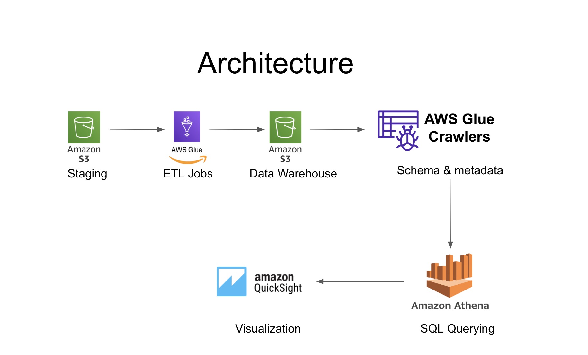

# Spotify Data Pipeline with AWS Glue and QuickSight

## Project Overview
This project is an end-to-end ETL pipeline designed to process and analyze Spotify data using AWS services. Leveraging AWS Glue for data transformation, Amazon Athena for querying, and Amazon QuickSight for visualization, the pipeline seamlessly ingests raw Spotify data from S3 staging, applies transformations, and loads the transformed data into a structured data warehouse. With automated metadata management and serverless querying capabilities, this pipeline enables efficient analytics and visualization, empowering stakeholders to gain valuable insights into user behavior and track music trends.
## Architecture


# Setup Guide

## Prerequisites
- AWS Account
- S3 Buckets for staging and data warehouse
- AWS Glue, Athena, and QuickSight permissions

# Steps to Reproduce

## 1. **Upload Data to S3**:

### S3 Bucket Structure

### Staging Bucket
- **Name**: `staging`
- **Purpose**: This bucket serves as the staging area for raw data before it's processed by the ETL pipeline.
- **Organization**: Raw data files are uploaded to the root of the bucket, with each file representing a specific data source.

### Data Warehouse Bucket
- **Name**: `warehouse`
- **Purpose**: Transformed data from the ETL pipeline is stored in this bucket for further analysis and visualization.
- **Organization**: Data is organized into folders corresponding to different datasets.

### Access Controls
- **Bucket Policies**: Only authorized IAM users or roles have access to read from or write to the buckets.
- **Encryption**: Data is encrypted at rest using AWS S3 encryption features to ensure security.

### Best Practices
- **Versioning**: Versioning is enabled on both buckets to maintain a history of changes and prevent accidental data loss.
- **Lifecycle Policies**: Lifecycle policies are applied to move data to cheaper storage tiers.

## 2. **Set Up AWS Glue Jobs**: [Script and Configuration](glue_jobs/)<br>

## 3. **Run AWS Glue Crawler**<br>

## 4. **Query Data with Amazon Athena**

### Example Query
```sql
SELECT artist_id, track_name FROM warehouse
WHERE genre = "LoFi"
GROUP BY artist_id
ORDER BY streams DESC;
```

## 5. **Visualize Data with QuickSight**
